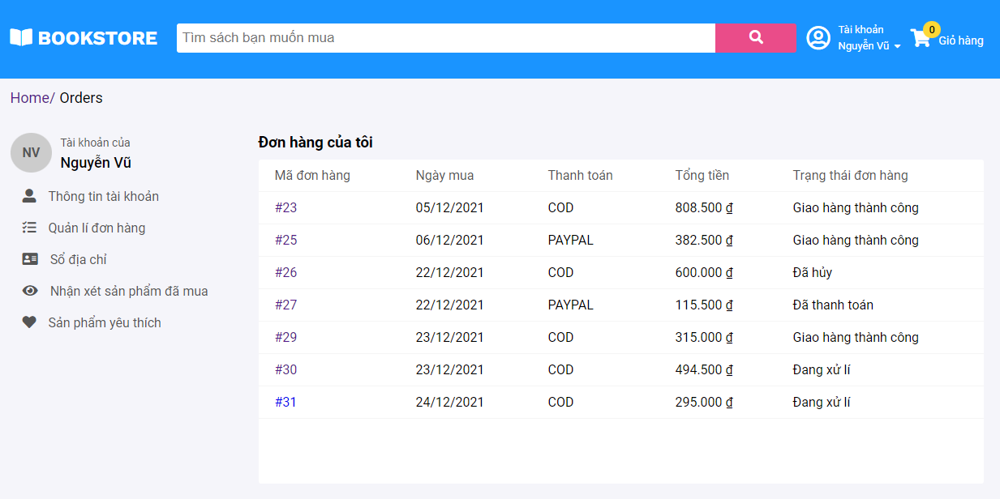
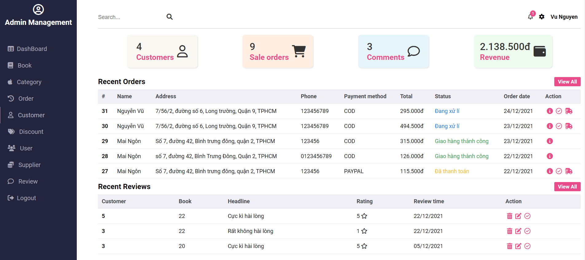

# BookStore E-Commerce!

_Author: Vu Nguyen_HTTT2019_

_Contact: vunguyen.311001@gmail.com_

**Demo**

**_1. Dashboard_**


**_2. Book Detail and Comments_**


**_3. Account_**



**_4. Customer order details_**


**_5. Cart_**


**_6. Customer checkout_**


**_7. Admin dashboard_**



**_8. Coupon, admin privileges,...._**

```javascript
function code() {
  console.log('Have a good day <3');
}
```

```
1 khách hàng có nhiều phiếu thu tiền
table: Payment

- payment_id
- customer_id
- Số tiền thu
- Số tiền nợ

tồn cuối = tồn đầu + (nhập - bán) = phát sinh

Tồn đầu tháng 2 = tồn cuối tháng 1


Tồn đầu, tồn cuối, phát sinh của tháng 5/2021

* Phát sinh = số lượng nhập của cuốn sách đó trong tháng 5 - số bán của sách đó trong tháng 5
$bookId;

$sql1 =  select sum(migrate_quantity) from inventory where year(purchase_date) = 2022 and month(purchase_date) = 5 and book_id = $bookId
=> số lượng nhập
$sql2 = select sum(quantity) from book_order b join order_detail o on b.order_id = o.order_d where year(b.order_date) = 2022 and month(b.order_date) = 5 and book_id = $bookId
=> số lượng bán


* Tồn đầu của tháng 5 =  Tổng tất cả nhập của các tháng trước < 5  -  tổng bán của các tháng trước < 5
$sql3 = select sum(migrate_quantity) from inventory where year(purchase_date) <= 2022 and month(purchase_date) < 5 and book_id = $bookId;
=> Tổng tất cả nhập của các tháng trước < 5

$sql2 = select sum(quantity) from book_order b join order_detail o on b.order_id = o.order_d where year(b.order_date) <= 2022 and month(b.order_date) < 5 and book_id = $bookId
=> Tổng bán của các tháng trước < 5


```
